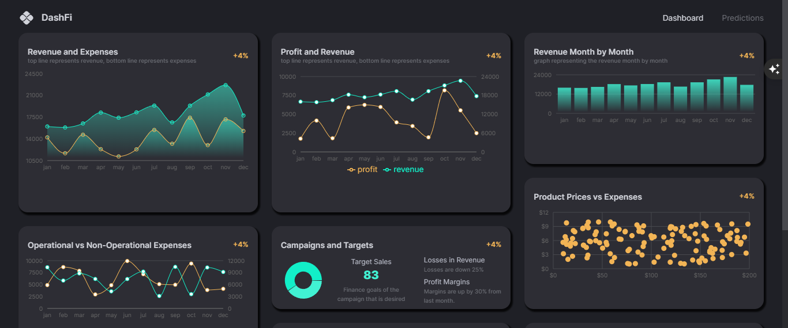
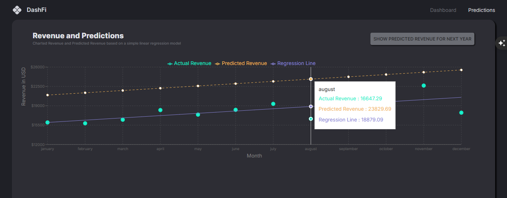

# 📊 DashFi - Financial Dashboard Application

<div align="center">
  <h3>🚀 Modern Financial Analytics & Predictive Dashboard</h3>
  <p>A comprehensive full-stack financial management system built with cutting-edge technologies</p>
  
  
  
  
  
  
</div>

---

## 🌟 Overview

**DashFi** is a sophisticated financial dashboard application that transforms complex financial data into actionable insights. Built with modern web technologies, it provides real-time analytics, predictive modeling, and comprehensive financial management tools in an intuitive, responsive interface.

## 📸 Screenshots

### Dashboard Overview

*Main dashboard featuring comprehensive financial metrics, KPI tracking, and interactive data visualizations*

### Analytics & Predictions

*Advanced analytics view with predictive modeling and detailed financial forecasting*

---

**[Link to the Backend](https://github.com/XBanTs/dashfi-backend)**

## ✨ Key Features

### 📈 **Financial Analytics**
- **Real-time KPI Tracking** - Monitor key performance indicators with live updates
- **Interactive Data Visualization** - Dynamic charts and graphs powered by Recharts
- **Comprehensive Metrics** - Revenue, expenses, profit margins, and growth analytics

### 🔮 **Predictive Intelligence**
- **Financial Forecasting** - Advanced regression analysis for future predictions
- **Trend Analysis** - Identify patterns and market trends
- **Risk Assessment** - Data-driven insights for informed decision making

### 💼 **Data Management**
- **Product Portfolio** - Complete product lifecycle management
- **Transaction Tracking** - Detailed transaction history and analysis
- **Multi-dimensional Data** - Comprehensive financial data modeling

### 🎨 **User Experience**
- **Modern UI/UX** - Clean, intuitive Material-UI design
- **Responsive Design** - Seamless experience across all devices
- **Dark/Light Themes** - Customizable visual preferences
- **Interactive Components** - Engaging data grid and visualization tools

---

## 🏗️ Architecture

### **Frontend (Client)**
```
React 19 + TypeScript + Vite
├── 🎨 Material-UI (MUI) - Modern component library
├── 🔄 Redux Toolkit - Predictable state management
├── 🛣️ React Router - Client-side routing
├── 📊 Recharts - Powerful data visualization
├── 🔢 Regression - Statistical analysis
└── ⚡ Vite - Lightning-fast build tool
```

### **Backend (Server)**
```
Node.js + Express.js
├── 🗄️ MongoDB + Mongoose - Document database
├── 🔒 Helmet - Security middleware
├── 🌐 CORS - Cross-origin resource sharing
├── 📝 Morgan - HTTP request logger
└── 🔧 dotenv - Environment configuration
```

---

## 🚀 Quick Start

### Prerequisites
- **Node.js** (v16 or higher)
- **MongoDB** (local or cloud instance)
- **npm** or **yarn**

### Installation

1. **Clone the repository**
   ```bash
   git clone <repository-url>
   cd DashFi
   ```

2. **Install server dependencies**
   ```bash
   cd server
   npm install
   ```

3. **Install client dependencies**
   ```bash
   cd ../client
   npm install
   ```

4. **Environment Setup**
   
   Create `.env` file in the server directory:
   ```env
   MONGO_URL=your_mongodb_connection_string
   PORT=9000
   ```
   
   Create `.env.local` file in the client directory:
   ```env
   VITE_BASE_URL=http://localhost:9000
   ```

5. **Start the application**
   
   **Terminal 1 - Start Backend:**
   ```bash
   cd server
   npm run dev
   ```
   
   **Terminal 2 - Start Frontend:**
   ```bash
   cd client
   npm run dev
   ```

6. **Access the application**
   - Frontend: `http://localhost:5173`
   - Backend API: `http://localhost:9000`

---

## 📁 Project Structure

```
DashFi/
├── 📂 client/                    # React frontend application
│   ├── 📂 src/
│   │   ├── 📂 components/        # Reusable UI components
│   │   ├── 📂 scenes/           # Page components
│   │   │   ├── 📂 dashboard/    # Dashboard views
│   │   │   ├── 📂 navbar/       # Navigation component
│   │   │   └── 📂 predictions/  # Prediction analytics
│   │   ├── 📂 state/            # Redux store configuration
│   │   ├── 📂 assets/           # Static assets
│   │   └── 📄 App.tsx           # Main application component
│   ├── 📂 public/               # Public assets & screenshots
│   └── 📄 package.json          # Frontend dependencies
├── 📂 server/                   # Express backend application
│   ├── 📂 data/                 # Sample data files
│   ├── 📂 models/               # Mongoose data models
│   ├── 📂 routes/               # API route handlers
│   ├── 📄 index.js              # Server entry point
│   └── 📄 package.json          # Backend dependencies
└── 📄 README.md                 # Project documentation
```

---

## 🛠️ API Endpoints

### **KPI Management**
- `GET /kpi` - Retrieve key performance indicators
- `POST /kpi` - Create new KPI entries

### **Product Management**
- `GET /products` - Fetch product portfolio
- `POST /products` - Add new products

### **Transaction Tracking**
- `GET /transaction` - Get transaction history
- `POST /transaction` - Record new transactions

---

## 🎯 Core Technologies

| Category | Technology | Purpose |
|----------|------------|---------|
| **Frontend Framework** | React 19 | Modern UI development |
| **Type Safety** | TypeScript | Static type checking |
| **State Management** | Redux Toolkit | Predictable state updates |
| **UI Components** | Material-UI | Professional design system |
| **Data Visualization** | Recharts | Interactive charts & graphs |
| **Build Tool** | Vite | Fast development & building |
| **Backend Framework** | Express.js | RESTful API development |
| **Database** | MongoDB | Document-based data storage |
| **ODM** | Mongoose | MongoDB object modeling |
| **Analytics** | Regression | Statistical analysis |

---

## 🔧 Development Scripts

### **Client Commands**
```bash
npm run dev      # Start development server
npm run build    # Build for production
npm run preview  # Preview production build
npm run lint     # Run ESLint
```

### **Server Commands**
```bash
npm run dev      # Start development server with nodemon
npm start        # Start production server
```

---

## 🌟 Features in Detail

### **Dashboard Analytics**
- **Multi-row Layout** - Organized data presentation across multiple dashboard rows
- **Real-time Updates** - Live data synchronization with backend
- **Interactive Charts** - Clickable and hoverable data visualizations
- **Responsive Grid** - Adaptive layout for different screen sizes

### **Predictive Modeling**
- **Regression Analysis** - Statistical forecasting using regression algorithms
- **Trend Visualization** - Visual representation of predicted trends
- **Confidence Intervals** - Statistical confidence in predictions
- **Historical Comparison** - Compare predictions with actual historical data

### **Data Management**
- **CRUD Operations** - Complete create, read, update, delete functionality
- **Data Validation** - Robust input validation and error handling
- **Bulk Operations** - Efficient handling of large datasets
- **Export Capabilities** - Data export in various formats

---

## 🤝 Contributing

We welcome contributions! Please follow these steps:

1. **Fork the repository**
2. **Create a feature branch** (`git checkout -b feature/amazing-feature`)
3. **Commit your changes** (`git commit -m 'Add amazing feature'`)
4. **Push to the branch** (`git push origin feature/amazing-feature`)
5. **Open a Pull Request**

---

## 📄 License

This project is licensed under the ISC License - see the [LICENSE](LICENSE) file for details.

---

## 🙏 Acknowledgments

- **Material-UI Team** - For the exceptional component library
- **Recharts Contributors** - For powerful data visualization tools
- **MongoDB Team** - For the flexible document database
- **React Community** - For the amazing ecosystem

---

<div align="center">
  <h3>🚀 Built with ❤️ for Financial Excellence</h3>
  <p>Transform your financial data into actionable insights with DashFi</p>
  
  **[⭐ Star this repository](https://github.com/XBanTs/dashfi-frontend)** if you found it helpful!
</div>
